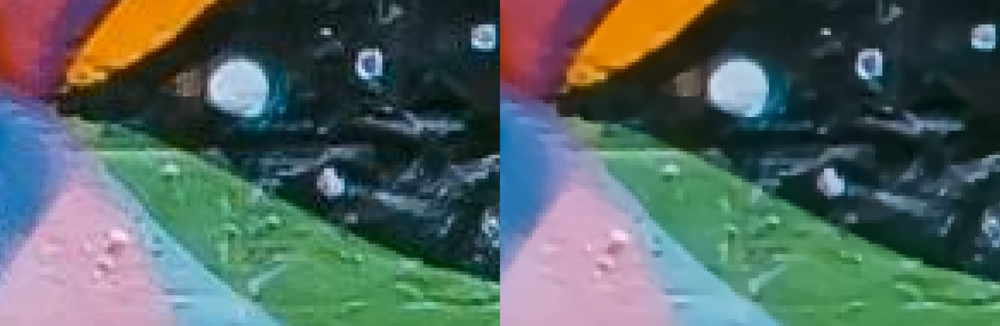

# artefact

## Decode JPEG without artifacts

-  Written in pure Rust, no `unsafe` code.
-  WASM-ready, check out the [web version](https://artefact.delnegend.com/), everything runs in your browser.
- ⚡  ***FASTER*** (~40-50%) than the of the original implementation [jpeg2png](https://github.com/victorvde/jpeg2png) project. ([backup link](https://github.com/ThioJoe/jpeg2png/tree/95f888f61c046d9adb55cd76ea9fde89c005b14f))

## Tests


> [Photo by Aleksandar Pasaric](https://www.pexels.com/photo/photo-of-neon-signage-1820770/)



> [Photo by Toa Heftiba Şinca](https://www.pexels.com/photo/selective-photograph-of-a-wall-with-grafitti-1194420/)

## [Web version](https://artefact.delnegend.com/)

## CLI version

### Pre-build binaries
WIP

### Build
Pre-requisites: [Rust toolchain](https://www.rust-lang.org/learn/get-started)

```bash
cargo build --release --package artefact-cli
```

The binary will be located at `./target/release/artefact-cli`

#### Build features
To toggle specific features when building the CLI, modify `artefact-cli/Cargo.toml` and add the desired features to the `[dependencies.artefact-lib] features` list.

```toml
[dependencies.artefact-lib]
path = "../artefact-lib"
features = [
    "simd", # enable SIMD acceleration using `wide` crate
    "simd_std", # enable SIMD acceleration using `std::simd` module, requires nightly Rust
    "mozjpeg", # use `mozjpeg` instead of `zune-jpeg` for decoding, might provide better compatibility
]
```

Recommendation: just stick with `simd` only.

#### Cross-compile
- Windows x64:
```bash
sudo apt update && sudo apt install gcc-mingw-w64-x86-64
rustup target add x86_64-pc-windows-gnu
nrr build-win-64
```

- Windows x86:
```bash
sudo apt update && sudo apt install gcc-mingw-w64-i686
rustup target add i686-pc-windows-gnu
nrr build-win-32
```

### Usage
```
Usage: artefact-cli [OPTIONS] <INPUT>

Arguments:
  <INPUT>
          The input jpeg file

Options:
  -o, --output <OUTPUT>
          The output png file

          Default: input file with png extension

  -y, --overwrite
          Overwrite existing output file

  -w, --weight <WEIGHT>
          Second order weight
          Higher values give smoother transitions with less staircasing

          Default: 0.3 for all channels, use comma separated values for each channel

  -p, --pweight <PWEIGHT>
          Probability weight
          Higher values make the result more similar to the source JPEG

          Default: 0.001 for all channels, use comma separated values for each channel

  -i, --iterations <ITERATIONS>
          Iterations
          Higher values give better results but take more time

          Default: 50 for all channels, use comma separated values for each channel

  -s, --spearate-components <SPEARATE_COMPONENTS>
          Separate components
          Separately optimize components instead of all together

          Default: false

          [possible values: true, false]

  -h, --help
          Print help (see a summary with '-h')

  -V, --version
          Print version
```

## Developement
- [vscode](https://code.visualstudio.com/) + [`devcontainer`](https://marketplace.visualstudio.com/items?itemName=ms-vscode-remote.remote-containers)

### Directories
- [`artefact-lib`](./artefact-lib/) - the implementation and pipeline
- [`artefact-cli`](./artefact-cli/) - command-line interface wrapper
- [`artefact-wasm`](./artefact-wasm/) - the [`wasm-pack`](https://github.com/rustwasm/wasm-pack) wrapper designed to build WebAssembly (WASM) modules compatible with modern browsers
- [`zune-jpeg`](./zune-jpeg/) - a minimized fork of [`zune-jpeg`](https://github.com/etemesi254/zune-image/tree/dev/crates/zune-jpeg) exposes the underlying DCT coefficients and quantization tables.

## License
Licensed under either of

- Apache License, Version 2.0 ([LICENSE-Apache](./LICENSE-Apache) or [apache.org/licenses/LICENSE-2.0](http://www.apache.org/licenses/LICENSE-2.0))
- MIT license ([LICENSE-MIT](./LICENSE-MIT) or [opensource.org/licenses/MIT](https://opensource.org/licenses/MIT))
at your option.

## Contribution
Unless you explicitly state otherwise, any contribution intentionally submitted for inclusion in the work by you, as defined in the Apache-2.0 license, shall be dual licensed as above, without any additional terms or conditions.
