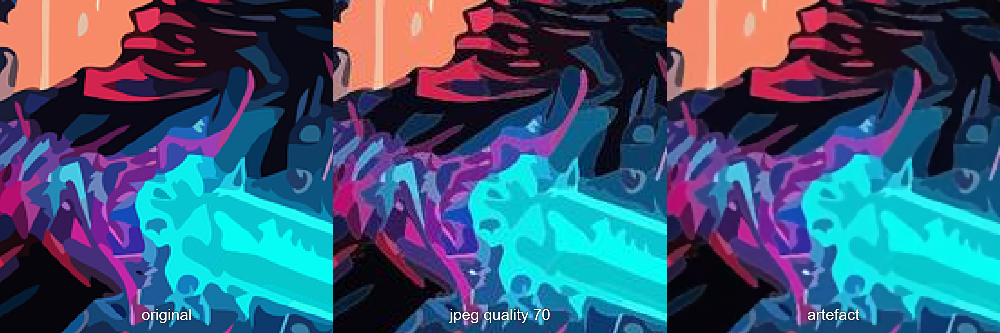
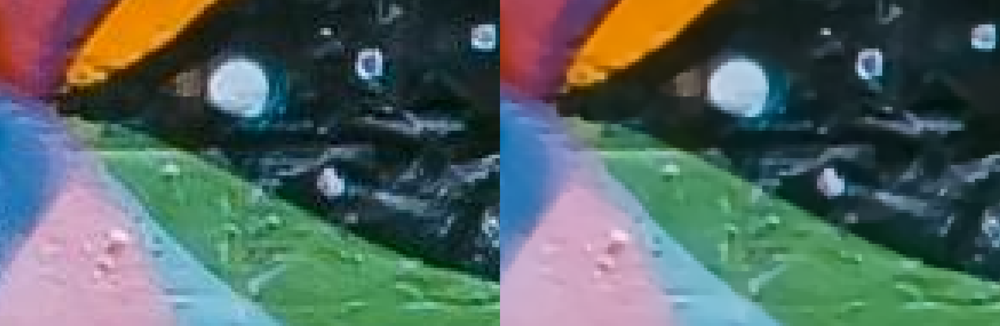
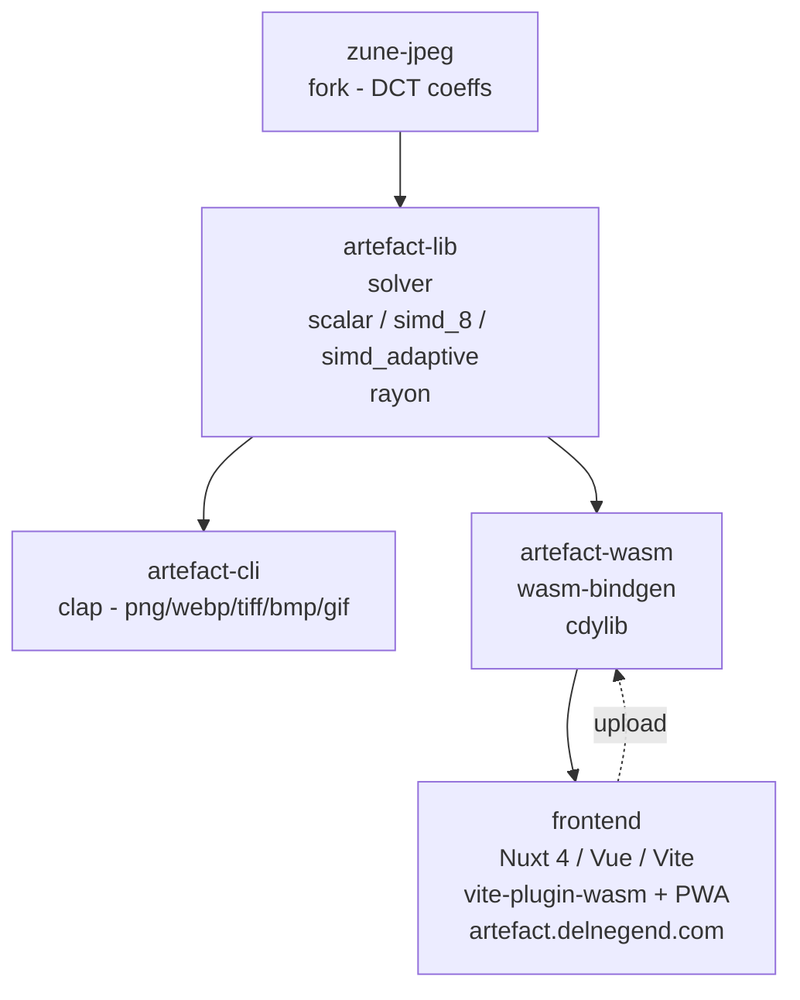

# artefact

[](https://www.rust-lang.org)
[](https://webassembly.org)
[](https://nuxt.com)
[](https://vuejs.org)
[](https://vitejs.dev)
[](https://bun.sh)
[](https://tailwindcss.com)
[](https://www.typescriptlang.org)
[](LICENSE-MIT)
[](#quick-start)

Reconstructs lost JPEG detail for smoother, more pleasing images — Rust rewrite of [jpeg2png](https://github.com/victorvde/jpeg2png), ~3× faster, runs natively via CLI or directly in the browser via WASM.

JPEG compression discards data and regular decoders "fill in" the gaps with noisy guesses that create visible artifacts. Instead of patching holes, artefact re-optimizes the DCT coefficients with a regularized solver to produce smoother gradients with less staircasing.

## Demos




> [Photo by Aleksandar Pasaric](https://www.pexels.com/photo/photo-of-neon-signage-1820770/)




> [Photo by Toa Heftiba Şinca](https://www.pexels.com/photo/selective-photograph-of-a-wall-with-grafitti-1194420/)

## Features

- **Rust core** — port of `jpeg2png` from C++ to Rust (`backend/artefact-lib`)
- **~3× faster** — `rayon` parallelism + optional SIMD (`wide` / `std::simd`, `simd_adaptive` for x8/x16/x32/x64 dispatch)
- **WASM-ready** — `backend/artefact-wasm` via `wasm-pack`, runs 100% client-side at [artefact.delnegend.com](https://artefact.delnegend.com) (no upload)
- **CLI + Web** — same solver for native binary (`artefact-cli`) and browser (`frontend` Nuxt + `vite-plugin-wasm`)
- **Flexible I/O** — input `.jpg`/`.jpeg`, output `png`/`webp`/`tiff`/`bmp`/`gif` (auto by extension)
- **Tunable solver** — per-channel `weight` / `pweight` / `iterations`, `separate_components` for YCbCr

## Quick start

### Installation

Pre-built CLI (recommended):

```bash
# download from Releases (output: artefact-cli, .exe on Windows)
# https://github.com/Delnegend/artefact/releases/latest
```

Build from source:

```bash
git clone https://github.com/Delnegend/artefact.git
cd artefact

# native CLI (release, uses mold + clang if in devcontainer)
cargo build --bin artefact-cli --release
# or: just build

# cross-compiled (linux x64 musl, windows x64, macOS arm64)
# built on GitHub Actions via .github/workflows/release.yml — see Development
```

Web (no install):

Open [artefact.delnegend.com](https://artefact.delnegend.com) — everything runs in your browser.

### Usage

**1. The performance way — CLI:**

```bash
# basic: input.jpg -> input.png (same dir)
artefact-cli input.jpg

# choose output and format
artefact-cli input.jpg -o output.webp --format webp -y

# tune solver (single value for all channels, or Y,Cb,Cr)
artefact-cli input.jpg --weight 0.3 --pweight 0.001 --iterations 50
artefact-cli input.jpg --weight 0.3,0.2,0.3 --iterations 50,30,50

# benchmark without writing file
artefact-cli input.jpg --benchmark

# help
artefact-cli --help
```

**2. The convenience way — browser:**

1. Go to [artefact.delnegend.com](https://artefact.delnegend.com)
2. Drop a JPEG
3. Compare input/output with the slider and download PNG

> WASM is slower than native but stays fully client-side.

## Development

### Prerequisites

**Recommended: devcontainer** — no host toolchain needed:

```
# VS Code: Command Palette → Reopen in Container
# CLI:
devcontainer up --workspace-folder .
```

Toolchain is baked into the image (Rust `nightly` + `rust-analyzer`, `mold` 2.40.4, `cargo-binstall`/`flamegraph`/`wasm-pack`, `just`, `fzf`, `bun`) for cache and for editors that skip `postCreateCommand` (e.g. Zed). `postinstall.sh` only runs `bun i` in `frontend`.

**Without devcontainer:**

- [Rust](https://www.rust-lang.org) via `rustup` (`nightly`, `minimal` profile)
- [`just`](https://github.com/casey/just), [`bun`](https://bun.sh), [`wasm-pack`](https://rustwasm.github.io/wasm-pack/)
- `zip`/`tar` only if manually archiving — releases (linux x64 musl, windows x64, macOS arm64) are built on GitHub Actions via `.github/workflows/release.yml`. `ffmpeg` only for sample image generation (not in devcontainer by default).

See [docs/development.md](docs/development.md) for full prerequisites and sample-image helpers.

### Repository overview

```
.
├── backend/
│   ├── artefact-lib/     # core solver — scalar / simd_8 / simd_adaptive pipelines
│   ├── artefact-cli/     # native binary (clap)
│   ├── artefact-wasm/    # wasm-pack cdylib for frontend
│   └── zune-jpeg/        # fork of zune-jpeg — exposes DCT coeffs + fixes
├── frontend/             # Nuxt 4 + Vue + Vite + Tailwind — src/utils/artefact-wasm is generated
├── assets/               # demo images (01.png-04.png)
└── docs/development.md   # directory structure, SIMD flags, cross-compile, WASM/web builds
```

Workspace versions are centralized in `[workspace.dependencies]` at the root `Cargo.toml:5` — bump once, inherited via `workspace = true` in each crate.

### Build

```bash
# frontend dev (hot reload)
just dev
# or: cd frontend && bun x nuxt dev --no-fork

# WASM lib (generates frontend/src/utils/artefact-wasm)
just build wasm
# or: wasm-pack build backend/artefact-wasm --target web --out-dir frontend/src/utils/artefact-wasm

# web (static generate for GitHub Pages)
just build web
# or: cd frontend && bun x nuxt generate

# native CLI (release, LTO)
just build            # -> target/release/artefact-cli
# or: cargo build --bin artefact-cli --release

# cross-compiled releases (linux x64 musl, windows x64, macOS arm64)
# built on GitHub Actions via .github/workflows/release.yml
# trigger: workflow_dispatch (release_version + create_release) or merged PR
```

SIMD / solver flags are toggled in `backend/artefact-lib/Cargo.toml` features (`simd`, `simd_std`, `simd_adaptive`, `native`, `moz`) and enabled in dependent crates — see [docs/development.md#simd-implementation](docs/development.md#simd-implementation).

### Checks

```bash
just check          # cargo fmt + cargo clippy + oxlint + prettier (all)
just check rust     # Rust only
just check js       # frontend only (oxlint + prettier)
```

Sample images with chroma subsampling:

```bash
just encode              # assets/sample.png -> assets/sample.{j444,j422,j420,444,422,420}.input.jpg (needs ffmpeg)
just decode 420          # -> assets/sample.420.decoded.png via artefact-cli
just flame 420           # flamegraph for profiling
```

## Architecture


```mermaid
graph TD
    Z[zune-jpeg<br/>fork - DCT coeffs] --> L[artefact-lib<br/>solver<br/>scalar / simd_8 / simd_adaptive<br/>rayon]
    L --> C[artefact-cli<br/>clap - png/webp/tiff/bmp/gif]
    L --> W[artefact-wasm<br/>wasm-bindgen<br/>cdylib]
    W --> F[frontend<br/>Nuxt 4 / Vue / Vite<br/>vite-plugin-wasm + PWA<br/>artefact.delnegend.com]
    F -. upload .-> W
```

`artefact-lib` is feature-gated: default scalar, `simd` enables `wide`, `simd_adaptive` adds runtime dispatch, `native` uses LLVM `mul_add` (`-Ctarget-cpu=native`), `moz` swaps `zune-jpeg` for `mozjpeg-sys`.

## CLI reference

| Flag | Short | Default | Description |
|---|---|---|---|
| `<input>` | — | — | Input JPEG file |
| `--output <path>` | `-o` | `<input>.png` | Output file (extension infers format when `--format auto`) |
| `--format <fmt>` | `-f` | `auto` | `auto` or `png`/`webp`/`tiff`/`bmp`/`gif` |
| `--weight <f32>` | `-w` | `0.3` | 2nd-order weight — higher = smoother, less staircasing. Single or `Y,Cb,Cr` |
| `--pweight <f32>` | `-p` | `0.001` | Fidelity weight — higher = closer to source JPEG |
| `--iterations <n>` | `-i` | `50` | Solver iterations — higher = better but slower. Single or `Y,Cb,Cr` |
| `--spearate-components` | `-s` | `false` | Optimize Y/Cb/Cr separately instead of jointly |
| `--benchmark` | `-b` | `false` | Run solver but don't write output |
| `--overwrite` | `-y` | `false` | Overwrite existing output |

Defined in `backend/artefact-cli/main.rs:6` and `backend/artefact-lib/lib.rs:50`.

## Contributing

PRs welcome. For large changes, please open an issue first.

```bash
git clone https://github.com/Delnegend/artefact.git
# devcontainer recommended, else install prerequisites above
just check   # must pass before PR
```

Unless you explicitly state otherwise, any contribution intentionally submitted for inclusion shall be dual-licensed as below without additional terms (per Apache-2.0 §5).

## License

Licensed under either of

- Apache License, Version 2.0 ([LICENSE-Apache](LICENSE-Apache) or http://www.apache.org/licenses/LICENSE-2.0)
- MIT license ([LICENSE-MIT](LICENSE-MIT) or https://opensource.org/licenses/MIT)

at your option.

## Acknowledgements

Based on [jpeg2png](https://github.com/victorvde/jpeg2png) by Victor van der Elst. Thanks to `zune-jpeg` / `zune-image` and the Rust / WASM / Nuxt communities.
