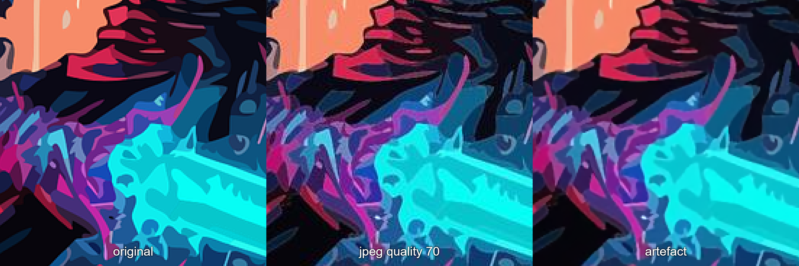
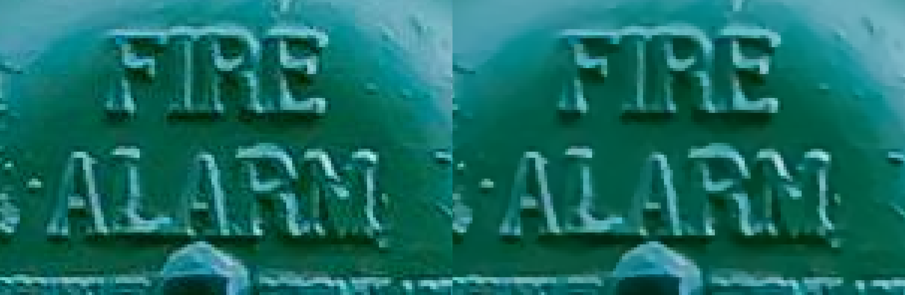
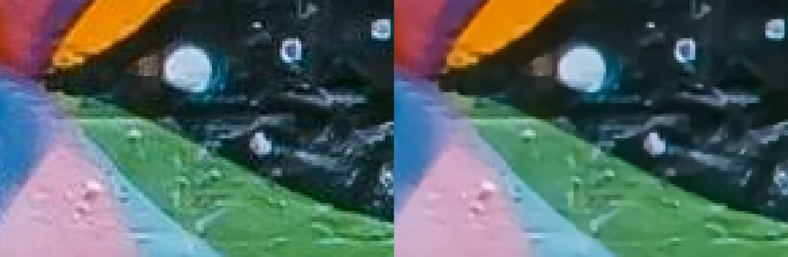
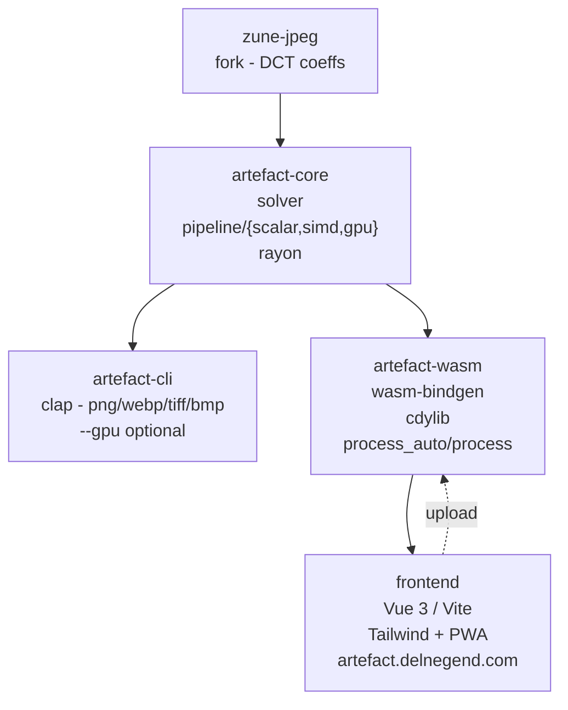

# artefact

[](https://www.rust-lang.org)
[](https://webassembly.org)
[](https://vuejs.org)
[](https://vitejs.dev)
[](https://bun.sh)
[](https://tailwindcss.com)
[](https://www.typescriptlang.org)
[](LICENSE-MIT)
[](#quick-start)

Reconstructs lost JPEG detail for smoother, more pleasing images — Rust rewrite of [jpeg2png](https://github.com/victorvde/jpeg2png), ~3× faster, runs natively via CLI or directly in the browser via WASM.

JPEG compression discards data and regular decoders "fill in" the gaps with noisy guesses that create visible artifacts. Instead of patching holes, artefact re-optimizes the DCT coefficients with a regularized solver to produce smoother gradients with less staircasing.

> **Maintenance mode.** Feature work is complete. The project receives automated dependency and security updates only — Dependabot runs daily with a 14-day cooldown, batched into weekly releases. Bug reports are welcome; new features and large changes are unlikely to be accepted.

## Demos




> [Photo by Aleksandar Pasaric](https://www.pexels.com/photo/photo-of-neon-signage-1820770/)




> [Photo by Toa Heftiba Şinca](https://www.pexels.com/photo/selective-photograph-of-a-wall-with-grafitti-1194420/)

## Features

- **Rust core** — port of `jpeg2png` from C++ to Rust (`backend/artefact-core`)
- **~3× faster** — `rayon` parallelism + optional SIMD (`std::simd`, adaptive x8/x16/x32/x64 dispatch via the `simd` feature; wasm uses uniform x8)
- **GPU acceleration** — optional `wgpu` backend for native and browser solves, with tolerance-checked equivalence and explicit CPU fallback
- **WASM-ready** — `backend/artefact-wasm` via `wasm-pack`, runs 100% client-side at [artefact.delnegend.com](https://artefact.delnegend.com) (no upload)
- **CLI + Web** — same solver for native binary (`artefact-cli`) and browser (`frontend` Vue 3 + Vite)
- **Flexible I/O** — input `.jpg`/`.jpeg`, output `png`/`webp`/`tiff`/`bmp` (auto by extension)
- **Tunable solver** — per-channel `weight` / `pweight` / `iterations`, `separate_components` for YCbCr

## Quick start

### Installation

Pre-built CLI (recommended) — <https://github.com/Delnegend/artefact/releases/latest> (`artefact-cli`, `.exe` on Windows).

Build from source:

```bash
git clone https://github.com/Delnegend/artefact.git
cd artefact
cargo build --bin artefact-cli --release   # or: just build
```

Web (no install) — open [artefact.delnegend.com](https://artefact.delnegend.com), drop a JPEG,
compare with the slider, download the PNG. Everything runs in your browser; nothing is uploaded.

### Usage

```bash
# basic: input.jpg -> input.png (same dir)
artefact-cli input.jpg

# choose output and format
artefact-cli input.jpg -o output.webp --format webp -y

# tune solver (single value for all channels, or Y,Cb,Cr)
artefact-cli input.jpg --weight 0.3 --pweight 0.001 --iterations 50
artefact-cli input.jpg --weight 0.3,0.2,0.3 --iterations 50,30,50

# benchmark without writing a file
artefact-cli input.jpg --benchmark

# use the GPU when available, otherwise fall back to the CPU
artefact-cli input.jpg --gpu

artefact-cli --help
```

Full flag table and tuning notes: [docs/cli.md](docs/cli.md).

## Architecture


```mermaid
graph TD
    Z[zune-jpeg<br/>fork - DCT coeffs] --> L["artefact-core<br/>solver<br/>pipeline/{scalar,simd,gpu}<br/>rayon"]
    L --> C[artefact-cli<br/>clap - png/webp/tiff/bmp<br/>--gpu optional]
    L --> W[artefact-wasm<br/>wasm-bindgen<br/>cdylib<br/>process_auto/process]
    W --> F[frontend<br/>Vue 3 / Vite<br/>Tailwind + PWA<br/>artefact.delnegend.com]
    F -. upload .-> W
```

The vendored `zune-jpeg` fork exposes the raw DCT coefficients; `artefact-core` re-optimizes them
with a feature-gated scalar/SIMD/GPU solver; the CLI and the wasm-pack bindings share that one
core. Details: [docs/architecture.md](docs/architecture.md).

## Documentation

- [docs/architecture.md](docs/architecture.md) — repository layout, how a solve works, solver pipelines and features
- [docs/cli.md](docs/cli.md) — every flag, tuning guidance, backend selection, reproducible benchmarks
- [docs/development.md](docs/development.md) — prerequisites, builds, `just check`, sample images, benchmarks, releases

## Development

The devcontainer (VS Code → *Reopen in Container*, or `devcontainer up --workspace-folder .`) bakes
in the whole toolchain. Without it you need Rust `nightly`, [`just`](https://github.com/casey/just),
[`bun`](https://bun.sh), and [`wasm-pack`](https://rustwasm.github.io/wasm-pack/).

```bash
just check      # fmt + clippy + tests + oxlint + oxfmt (must pass before a PR)
just dev        # frontend dev server
just build      # release CLI -> target/release/artefact-cli
```

## Contributing

The project is in **maintenance mode**: bug fixes and dependency/security updates are welcome, but
feature work is paused. Please open an issue before starting anything substantial.

Unless you explicitly state otherwise, any contribution intentionally submitted for inclusion shall
be dual-licensed as below without additional terms (per Apache-2.0 §5).

## License

MIT or Apache-2.0, at your option.

## Acknowledgements

Based on [jpeg2png](https://github.com/victorvde/jpeg2png) by Victor van der Elst. Thanks to `zune-jpeg` / `zune-image` and the Rust / WASM / Vue / Vite communities.
