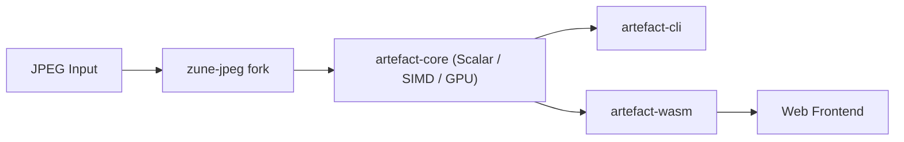

<div align="center">

# Artefact

**Reconstructs lost JPEG detail for smoother, cleaner images with reduced compression artifacts.**

[](https://github.com/Delnegend/artefact/actions)
[](https://github.com/Delnegend/artefact/releases)
[](LICENSE-MIT)

</div>

---

> **Maintenance mode.** Feature work is complete. The project receives automated dependency and security updates with a 14-day supply-chain quarantine, batched into weekly releases. Bug reports are welcome; new features are not accepted.

## Quick Start

Get running in less than 60 seconds:

```bash
# 1. Download prebuilt binary (Linux, Windows, macOS)
curl -fsSL https://github.com/Delnegend/artefact/releases/latest/download/artefact-cli-linux-x64.tar.gz | tar -xz

# 2. Reconstruct an image
./artefact-cli input.jpg -o output.png

# 3. Web browser (zero install)
# Visit https://artefact.delnegend.com to drop and compare images locally with WebAssembly/WebGPU.
```

## Highlights

- **Artifact reduction** — Re-optimizes raw DCT coefficients with a regularized solver rather than making pixel-level guesses.
- **High throughput** — Multi-threaded execution with adaptive SIMD vectorization and optional WebGPU acceleration.
- **Cross-platform** — Runs as a single static native CLI or entirely client-side in the browser via WebAssembly (zero uploads).
- **Flexible output** — Ingests standard `.jpg`/`.jpeg` files and exports to PNG, WebP, TIFF, or BMP.

## Common Options

```bash
# Typical command for daily use
artefact-cli input.jpg -o output.webp --gpu -y
```

| Option | Default | Description |
|---|---|---|
| `-o, --output <path>` | `<input>.png` | Path for reconstructed output image |
| `-f, --format <fmt>` | `auto` | Output format (`auto`, `png`, `webp`, `tiff`, `bmp`) |
| `-w, --weight <f32>` | `0.3` | Smoothness weight (higher = smoother transitions) |
| `-p, --pweight <f32>` | `0.001` | Fidelity weight (higher = closer to source JPEG) |
| `-g, --gpu` | `false` | Enable GPU solver with automatic CPU fallback |

For all flags, per-channel tuning, and benchmark options, see **[CLI Reference](docs/cli.md)**.

## Architecture


```mermaid
flowchart LR
    JPEG[JPEG Input] --> Decode[zune-jpeg fork]
    Decode --> Solver["artefact-core (Scalar / SIMD / GPU)"]
    Solver --> CLI[artefact-cli]
    Solver --> WASM[artefact-wasm]
    WASM --> Web[Web Frontend]
```

For component boundaries, internal pipelines, and design decisions, see **[Architecture Guide](docs/architecture.md)**.

## Documentation

- **[CLI Reference](docs/cli.md)** — Command-line flags, tuning guide, and benchmark options.
- **[Architecture](docs/architecture.md)** — Solver pipelines, data flow, and repository layout.
- **[Development](docs/development.md)** — Prerequisites, builds, `just check`, and profiling.

## License

Dual-licensed under [MIT](LICENSE-MIT) or [Apache 2.0](LICENSE-Apache).
