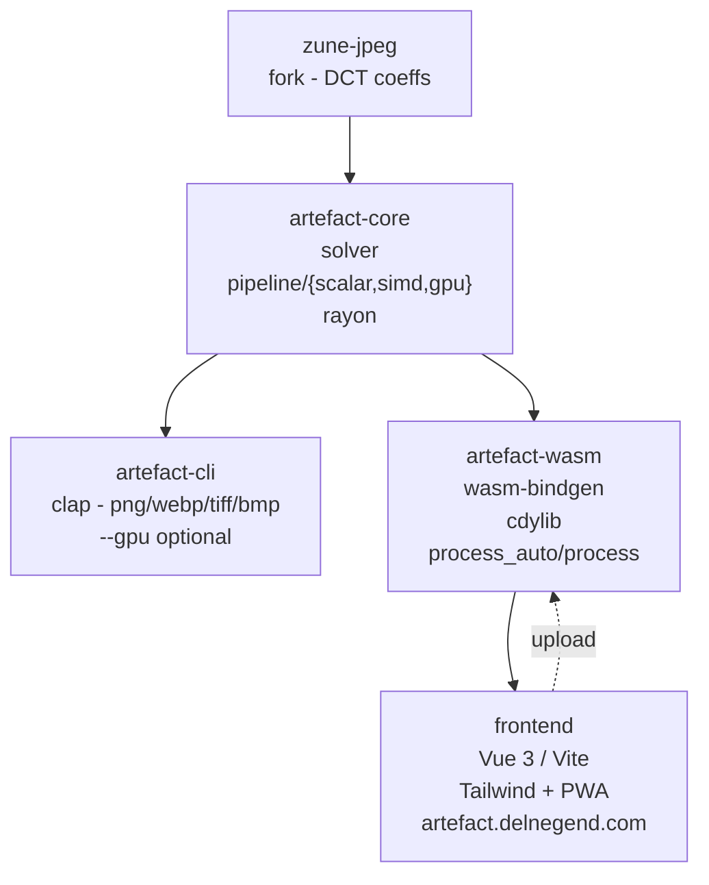

# Architecture



## Repository layout

```
.
├── backend/
│   ├── artefact-core/    # core solver — pipeline/{scalar,simd,gpu} + shared utils
│   ├── artefact-cli/     # native binary (clap)
│   ├── artefact-wasm/    # wasm-pack cdylib for frontend
│   └── zune-jpeg/        # fork of zune-jpeg — exposes DCT coeffs + fixes
├── frontend/             # Vue 3 + Vite + Tailwind — src/utils/artefact-wasm is generated
├── assets/               # demo images (01.png-04.png) + generated sample fixtures
└── docs/                 # this directory
```

Workspace versions are centralized in `[workspace.dependencies]` at the root `Cargo.toml` — bump
once, inherited via `workspace = true` in each crate.

## How a solve works

1. The vendored `zune-jpeg` fork decodes the JPEG and exposes the raw DCT coefficients — the
   high-frequency detail a normal decoder throws away is exactly what artefact needs.
2. `artefact-core` re-optimizes those coefficients with a regularized solver (2nd-order weight +
   fidelity weight, iterated) instead of guessing pixel values in the gaps.
3. The reconstructed coefficients are encoded to the requested output format.

Decoding always goes through the fork, on every backend.

## Solver pipelines

`artefact-core` is feature-gated; pipelines live in `pipeline/{scalar,simd,gpu}` with shared logic
in `utils/`.

- **Scalar** (`pipeline::scalar`) is the frozen reference implementation.
- **SIMD** (`pipeline::simd`, the `simd` feature) is the production default. Native uses adaptive
  x8/x16/x32/x64 dispatch over `std::simd`; wasm32 uses uniform x8 because wider `std::simd`
  vectors miscompile there.
- **GPU** (`pipeline::gpu`, the `gpu` feature) solves with one storage buffer per channel plus
  `aux` scratch, `meta` metadata, and uniform `params`. It uses gather-only compute kernels, two
  submits per iteration, and a reusable `GpuContext`; `process_gpu_with` allows repeated solves
  without recreating the device/queue.

Feature selection: `simd` selects the CPU SIMD pipeline (or scalar without it); `gpu` adds
`process_gpu`, `process_gpu_with`, and `process_auto`, which falls back to CPU when no adapter or
solver is available.

[`artefact-cli`](../backend/artefact-cli/Cargo.toml) and
[`artefact-wasm`](../backend/artefact-wasm/Cargo.toml) enable `simd,gpu`, so both shipped binaries
can use SIMD and the GPU backend. Enable them manually for ad-hoc builds with
`--features simd,gpu`:

```toml
[dependencies.artefact-core]
path = "../artefact-core"
features = ["simd"] # adaptive x8/x16/x32/x64 dispatch via `std::simd`
```

## Web path

The async wasm `compute` API takes `use_gpu`; the browser worker probes for a usable WebGPU
adapter (including `GPUAdapter.info`) and requests the CPU otherwise. The PWA precache includes
`wasm`.
